#  1. 서비스 소개 


## 1) TMI이란?

`TMI`은 **Tech Mania's Information** 의 약자로, 다양한 플랫폼에 흩어져 있는 `기술블로그`의 글을 모아서 볼 수 있는 `큐레이션 커뮤니티 서비스`입니다.

개발자는 하루에도 수차례 원하는 정보를 검색하지만, 광고성 블로그나 신뢰하기 어려운 글에 시간을 허비하기 쉽습니다. `TMI` 는 이런 문제를 해결하기 위해 **자동 요약과 태그 기반 검색**을 제공하여, 원하는 정보를 빠르고 정확하게 확인할 수 있도록 돕습니다.

관심 있는 기술을 설정하면 해당 주제를 다루는 글을 추천받을 수 있고, 마음에 드는 글은 팔로워들과 함께 공유하며 토론할 수 있습니다. 단순히 정보를 소비하는 것을 넘어 **팔로우, 댓글, 추천, 뱃지 시스템**을 통해 커뮤니티 경험을 제공합니다.

### `TMI` 핵심 가치
- *Easy Search* : 태그 중심의 빠르고 직관적인 검색
- *High Quality* : AI 요약과 자동 태그로 신뢰성 높은 정보 제공
- *By Sharing* : 팔로우, 알림, 뱃지를 통한 지속적 소통과 학습

## 2) 개발기간

- 2025-07-14 ~ 2025-08-18 (총6주)
  - Sub1 : 2025-07-14 ~ 2025-07-20
  - Sub2 : 2025-07-21 ~ 2025-08-01
  - Sub3 : 2025-08-03 ~ 2025-08-19

## 3) 산출물 모아보기

**와이어프레임**


👉 [Figma](https://www.figma.com/design/xLg08rwjPnpnF8fNrDpRLy/%EA%B3%B5%ED%86%B5-%ED%94%84%EB%A1%9C%EC%A0%9D%ED%8A%B8?node-id=0-1&t=nwiGkqgRz5QkPDja-0) 에서 살펴보기


**컴포넌트 구조도**

👉 [Figma](https://www.figma.com/design/xLg08rwjPnpnF8fNrDpRLy/%EA%B3%B5%ED%86%B5-%ED%94%84%EB%A1%9C%EC%A0%9D%ED%8A%B8?node-id=0-1&t=nwiGkqgRz5QkPDja-0) 에서 살펴보기

**기능 기획서**

👉 [팀 노션 페이지](https://enchanted-headphones-9a0.notion.site/229cf38b9ab18134a582d43ad604361e?pvs=73) 링크

 **API 명세서**

👉 [팀 노션 페이지](https://enchanted-headphones-9a0.notion.site/API-229cf38b9ab1817da423eacd3693bde6) 링크

**시연 UCC**

👉 [영상]() 으로 확인하기


## 4) 팀 소개
  - 박승규
    - 기획 및 설계
      - 화면 설계서 작성 및 정리
    - Frontend
      - 게시글 관리 시스템 구현
      - 검색 및 필터링 인터페이스 개발
      - API 연동 및 소셜 기능 구현
      - 컴포넌트 아키텍처 설계 및 상태 관리
  - 서윤미
    - 기획 및 설계
      - 화면 설계서 작성 및 정리
    - Frontend
      - 전역변수, 레이아웃 제작 및 관리
      - API 연동 및 소셜 로그인 기능 구현
    - 기타
      - 중간 발표 자료 제작
      - 영상 포트폴리오 제작
  - 소태호
    - 팀장 업무
      - 팀의 전체적인 일정 관리
        - BE, FE 파트 별 일정 주 단위 스크럼 및 Jira를 통해 관리
      - 기술 스택 공유
      - 프로젝트 산출물 자료 관리
        - 기능 정의, ERD 설계, 발표 자료 정리
      - 프로젝트 방향 설정
        - 기술 스택, 세부 기능같이 프로젝트의 진행에 영향을 끼칠 수 있는 요소들을 시간 내 끝낼 수 있도록 관리
    - 프로젝트 기획 및 설계
      - DB 및 API 설계
    - Backend
      - 크롤링 기반 링크 요약 API 구현
      - 파일 업로드 및 이미지 출력 API 구현
    - Infra
      - EC2 배포 환경 구성 : Docker를 이용하여 구성 요소 컨테이너화
      - Jenkins Pipeline 구축 - 백엔드와 프론트 엔드 CI/CD 구성
      - Nginx를 통한 리버스 프록시 구축, 웹 서버 구축, SSL/TLS 구현
    - 기타
      - 최종 발표 영상 포트폴리오 제작
  - 윤여옥
    - 프로젝트 기획 및 설계
      - DB 및 API 설계
    - Backend
      - JWT 인증 & 권한부여
      - 로그인 & 회원가입 기능
      - 회원관리 기능
      - 팔로우 / 알림 / 뱃지 기능  
    - 기타:
      - 최종 발표
      - 최종 발표 자료 작성
  - 이은성
    - 프로젝트 기획 및 설계
      - DB 및 API 설계
    - Backend
      - 인기 게시글 선정 기능 및 게시글 검색 기능    
      - 최신 게시글 조회 및 팔로우, 스타 게시글 조회 기능
      - 상세 게시글 조회 및 게시글 작성, 수정, 삭제 기능
      - 댓글 / 댓글 추천 / 태그 조회 및 검색 기능
      - SSE 를 활용한 실시간 알림 전송 기능
      - Event - Listener 구조를 활용한 뱃지 획득 및 알림 생성 기능
    - 기타
      - 중간 발표
      - 회의록 기록 등 문서 관리
      - 최종 발표 영상 포트폴리오 제작
  - 하재민
    - 기획 및 설계
      - 화면 설계서 작성 및 정리
      - 배지 이미지 제작 및 적용
    - Frontend
      - 마이페이지 및 알림 페이지 퍼블리싱
      - 각 페이지별 API 연동 개발
      - 기능 오류 수정 및 품질 개선

## 5) 기능 소개

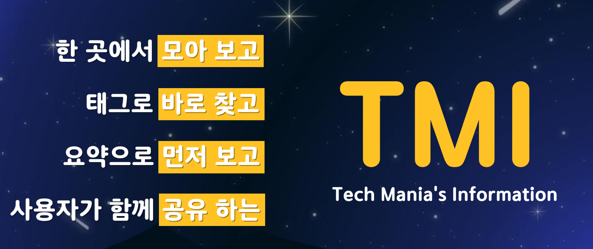


### (1) 게시글 커뮤니티 기능

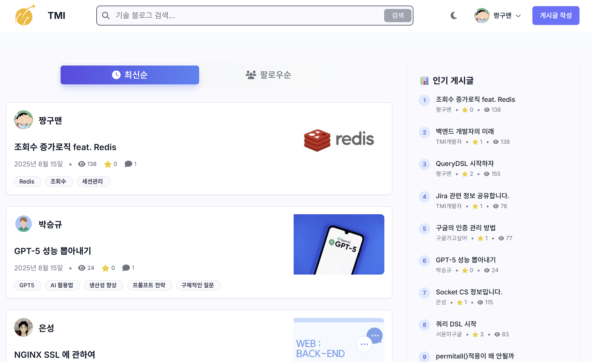


**개발자들을 위한 지식 공유와 토론의 장**

사용자는 관심 있는 블로그 글을 공유하고, 댓글을 통해 의견을 나누며 서로 인사이트를 얻을 수 있습니다. 단순한 정보 소비를 넘어서, 피드백과 토론을 통한 능동적 학습이 가능해집니다.

메인 페이지의 우측 상단에는, 조회수와 스타 수를 기반으로 한 실시간 인기 게시글 목록이 제공됩니다. 사용자는 현재 인기있는 글과 트렌드를 단번에 파악 가능합니다. 

### (2) AI 요약 기능


**읽기 전에 핵심 먼저 확인**

긴 블로그 원문을 일일이 다 읽을 필요 없이, AI가 핵심 내용을 요약해 먼저 보여줍니다. 사용자는 글의 신뢰성과 필요성을 빠르게 판단할 수 있고, 시간을 절약하면서 더 많은 정보를 접할 수 있습니다.

### (3) 다양한 태그 검색 기능


**내가 원하는 글을 한 번에 찾는다**

키워드뿐만 아니라 약 500개 이상의 태그를 기반으로 검색할 수 있어, 특정 기술이나 기업 관련 글을 정확하게 찾을 수 있습니다. 흩어져 있던 정보들을 한곳에서 정리된 방식으로 접근할 수 있습니다.

### (4) 팔로우 및 스타


**개인 맞춤형 구독 경험**

좋아하는 기업이나 개발자를 팔로우하면, 그들의 새로운 글을 메인과 마이페이지에서 바로 확인할 수 있습니다. 또, 마음에 드는 글에는 스타를 눌러 저장하고 추천할 수 있어 나만의 큐레이션 공간을 만들 수 있습니다.

### (5) 뱃지 획득 및 전시


**활동을 기록하고 동기를 부여하는 보상 시스템**

처음 글을 작성하거나, 특정 조건(조회수·추천수·댓글 수 등)을 달성하면 뱃지를 획득할 수 있습니다. 뱃지는 마이페이지에 전시되며, 커뮤니티 참여를 재미있게 이어가도록 동기를 부여합니다.

## 6) 기술 스택

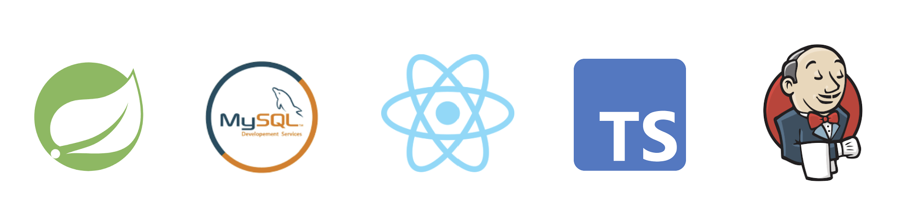

🖱**Backend**

- Java 1.17
- SpringBoot 3.5.3
- Spring Security
- Spring Data JPA
- MySQL 8.0.23

🖱**Frontend**

- React19
- TypeScript
- Tailwind CSS
- Zustand

🖱**CI/CD**

- AWS EC2
- Docker
- Nginx
- Jenkins

#   2. 기획

## 1) 화면정의서

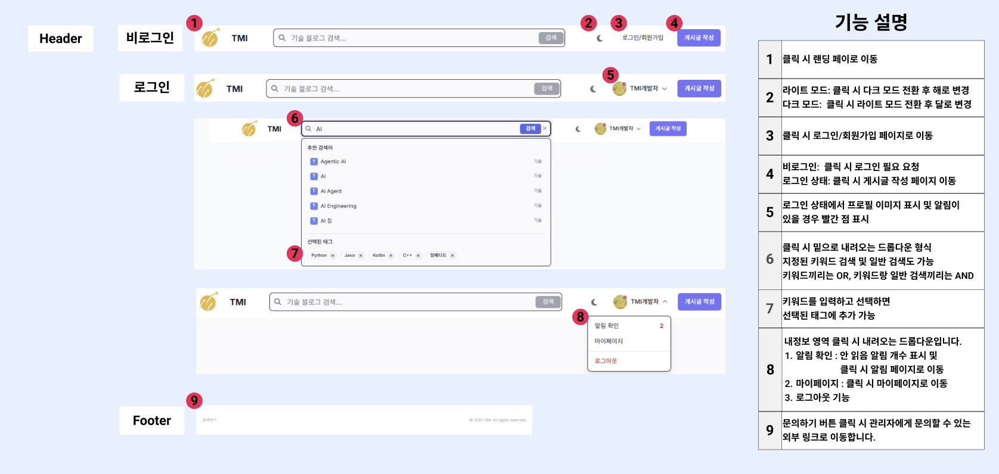

👉 [Figma](https://www.figma.com/design/xLg08rwjPnpnF8fNrDpRLy/%EA%B3%B5%ED%86%B5-%ED%94%84%EB%A1%9C%EC%A0%9D%ED%8A%B8?node-id=0-1&t=nwiGkqgRz5QkPDja-0) 에서 살펴보기

## 2) 와이어프레임
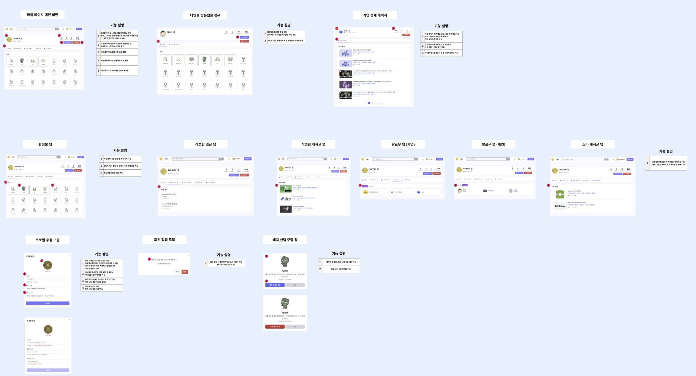

👉 [Figma](https://www.figma.com/design/xLg08rwjPnpnF8fNrDpRLy/%EA%B3%B5%ED%86%B5-%ED%94%84%EB%A1%9C%EC%A0%9D%ED%8A%B8?node-id=0-1&t=nwiGkqgRz5QkPDja-0) 에서 살펴보기


## 3) 컴포넌트 구조도(FE)

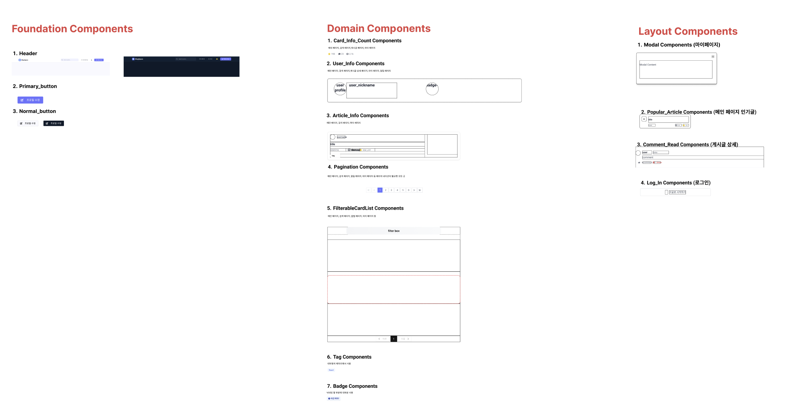

👉 [Figma](https://www.figma.com/design/xLg08rwjPnpnF8fNrDpRLy/%EA%B3%B5%ED%86%B5-%ED%94%84%EB%A1%9C%EC%A0%9D%ED%8A%B8?node-id=0-1&t=nwiGkqgRz5QkPDja-0) 에서 살펴보기


#   3. 설계

## 1) ERD
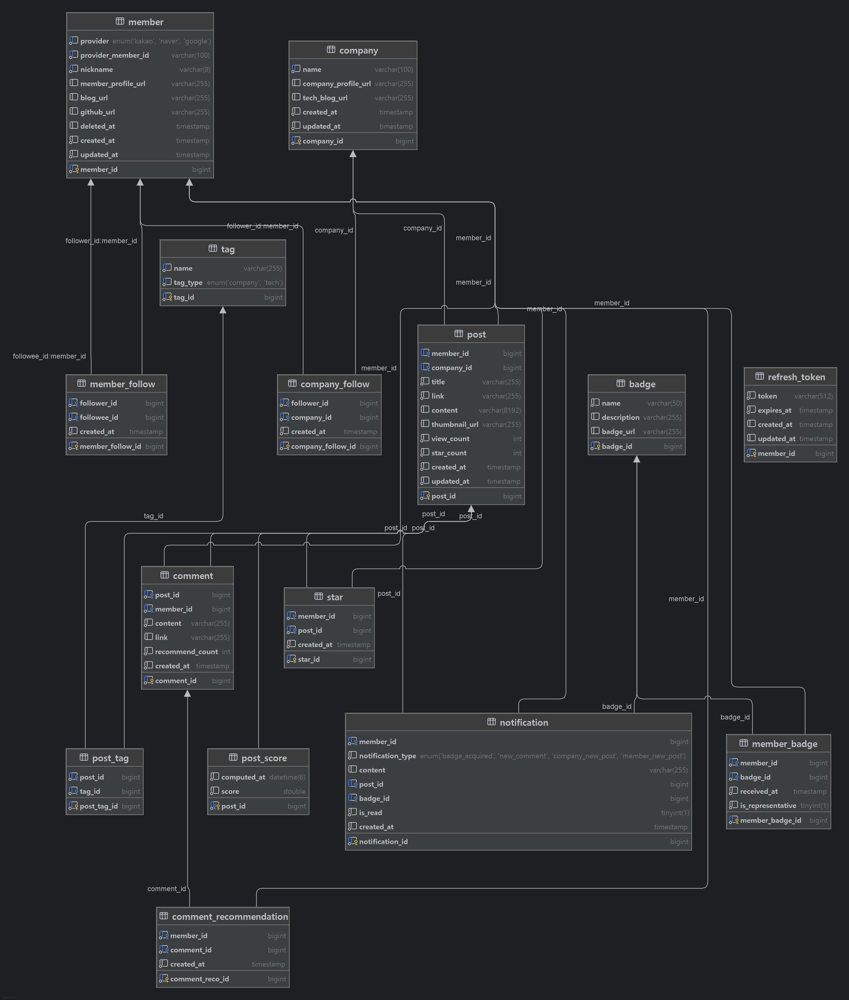

## 2) 요구사항 정의서

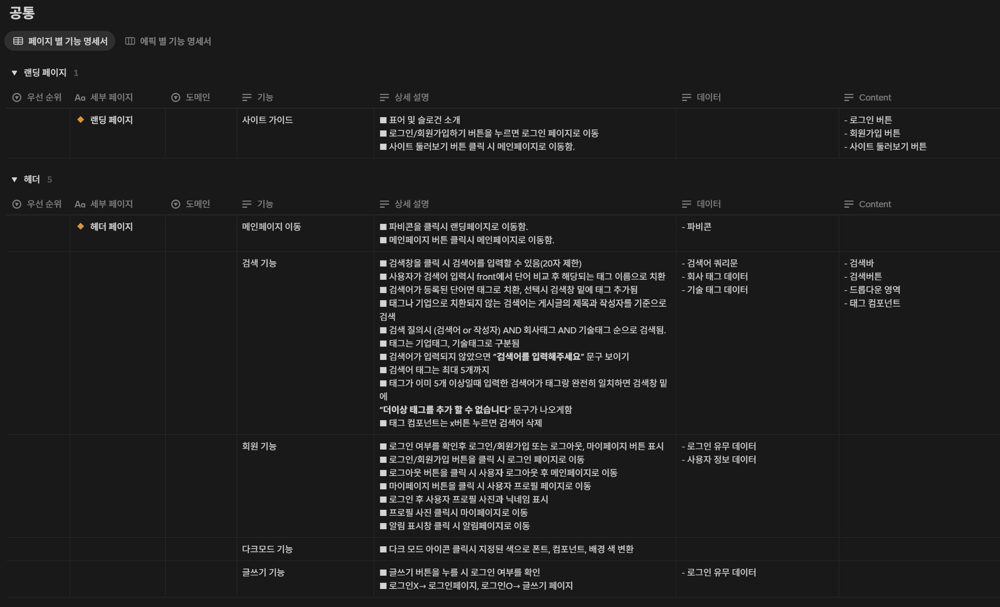
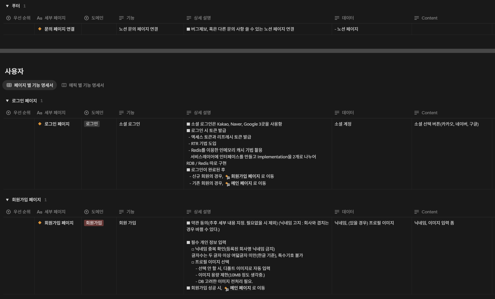

👉 [팀 노션 페이지](https://enchanted-headphones-9a0.notion.site/229cf38b9ab18114812df967484a824a) 에서 더 살펴보기


## 3) API 명세서

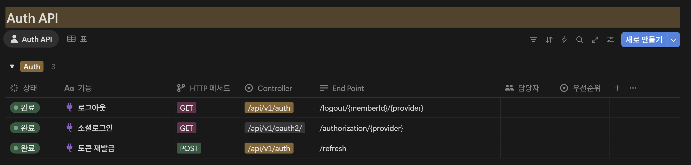
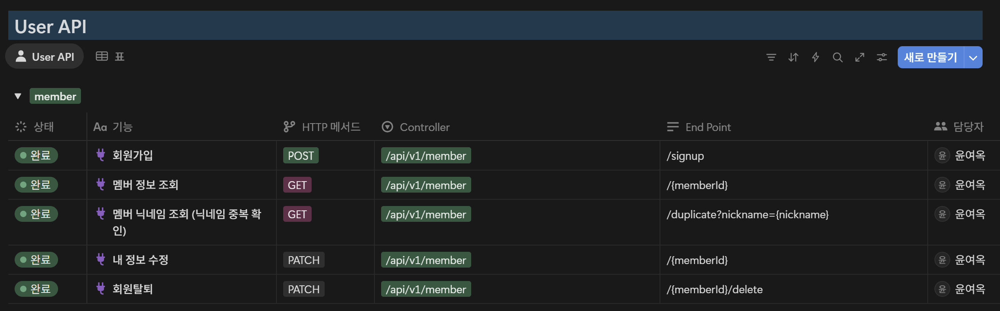

👉 [팀 노션 페이지](https://enchanted-headphones-9a0.notion.site/API-229cf38b9ab1817da423eacd3693bde6?pvs=74) 에서 더 살펴보기

## 4) 아키텍쳐

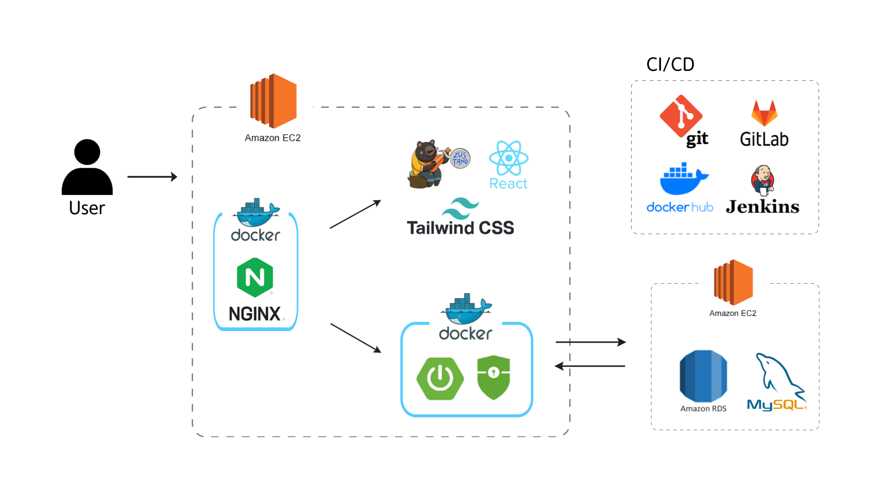

# 3. 설치 및 사용법

깃허브에 접속해 `clone` 받으신 후, `clone` 받은 디렉토리에서 아래의 순서대로 설치를 진행합니다.  

👉 [깃허브 주소](https://github.com/techmaniasinformation/TMI)

## 1) 백엔드

- [https://i13a509.p.ssafy.io/api/v1](https://i13a509.p.ssafy.io/api/v1) 이하로 요청 시 테스트 가능
- 사용법
  - clone 받은 후 sts나 IntelliJ에서 프로젝트 우클릭
  - Run as SpringBoot App으로 실행

## 2) 프론트엔드

- [Node.js](https://nodejs.org/ko/) 설치

- 프론트엔드 디렉토리로 이동.

```bash
cd {클론 받은 폴더}/frontend
```

- 아래의 명령어를 실행

```bash
npm install
npm run serve
```

#   4. 협업

## 1) Git 활용


## 2) Git 컨벤션

- **브랜치 이름**

      유형-이슈넘버(jira)-기능ID-요약

- **Commit 메시지**

      [Jira-티켓명] <타입> 기능 내용 요약

- **Commit 유형**

  ```
  FEAT: 새로운 기능 추가 [#S06P12A101-89]
  FIX: 버그 수정 
  DOCS: 문서 수정
  STYLE: 코드 formatting, 세미콜론 누락, 코드 자체의 변경이 없는 경우
  REFACTOR: 코드 리팩토링
  TEST: 테스트 코드, 리팩토링 테스트 코드 추가
  CHORE: 패키지 매니저 수정, 그 외 기타 수정 ex) .gitignore
  DESIGN: CSS 등 사용자 UI 디자인 변경
  COMMENT: 필요한 주석 추가 및 변경
  RENAME: 파일 또는 폴더 명을 수정하거나 옮기는 작업만인 경우
  REMOVE: 파일을 삭제하는 작업만 수행한 경우
  ```

## 3) Jira

기능들을 `Jira` Issue로 등록, `업무 진행 상황`을 관리합니다. 각 이슈별로 기능별 ID, 스토리포인트, 담당자 등을 배분한 뒤 Jira issue를 등록합니다. 

번다운 차트를 활용하여, 스프린트에 작업할 스토리 포인트를 유연하게 설정하도록 합니다. 


참고자료 1: 
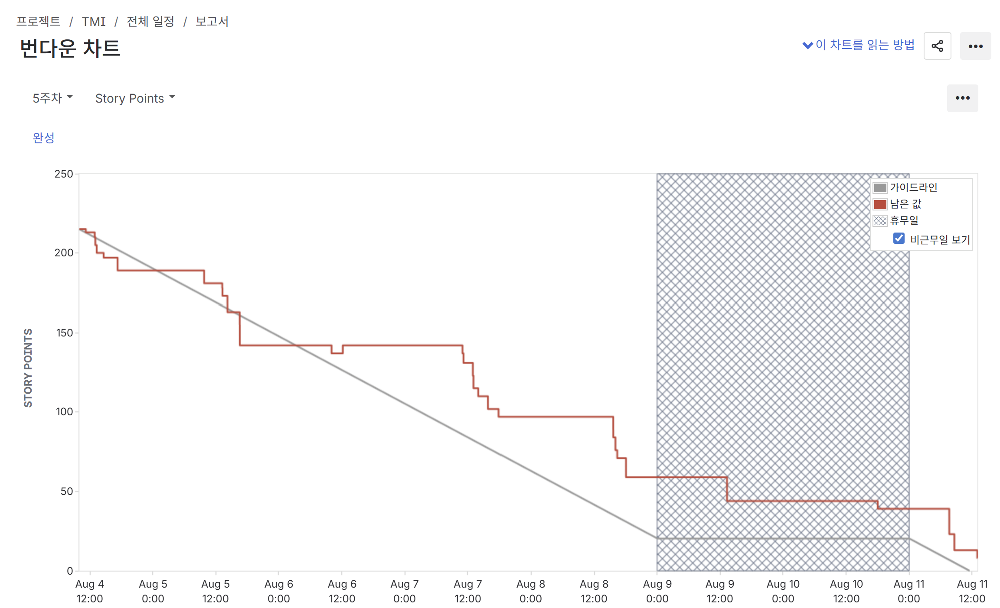

참고자료 2: 
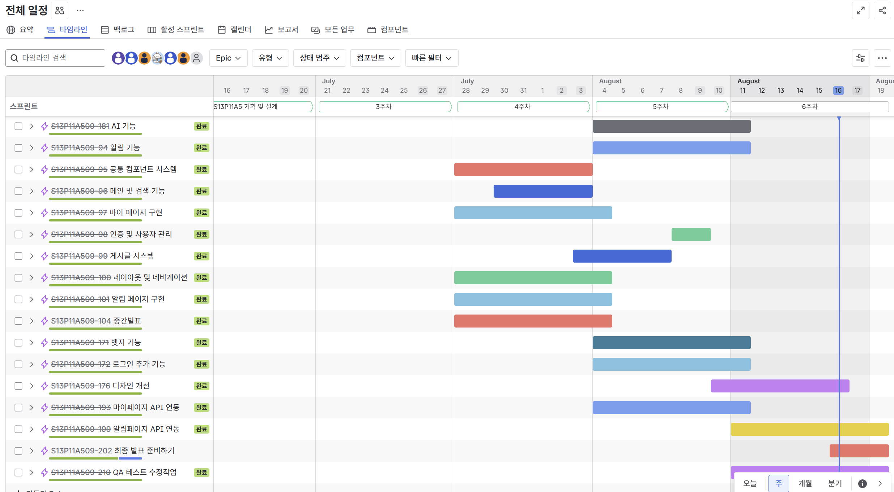

## 4) Notion

### (1) 컨벤션 및 환경 설정 공유

협업에 필요한 규칙들과 설정들을 `매뉴얼화`하여 일목요연하게 관리합니다. 각종 환경 설정이나 설치법 등을 공유하여 셋팅 오류를 최소화하고 개발에 집중할 수 있습니다. 

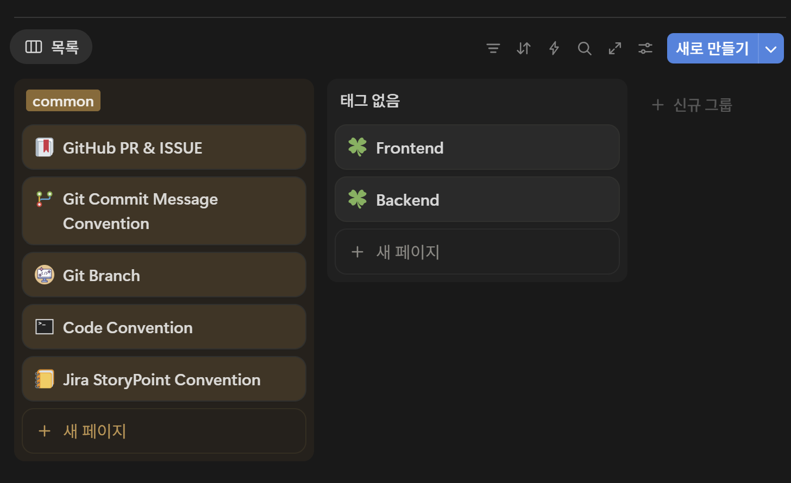

### (2) 기술 공유

참고할 만한 `외부 자료` 등을 `문서화` 후 공유하고 있습니다. 코딩 시 발생했던 `오류`들 또한 `문서화`하여 추후 `동일 문제가 발생`할 시 `신속하게 해결`할 수 있습니다. 

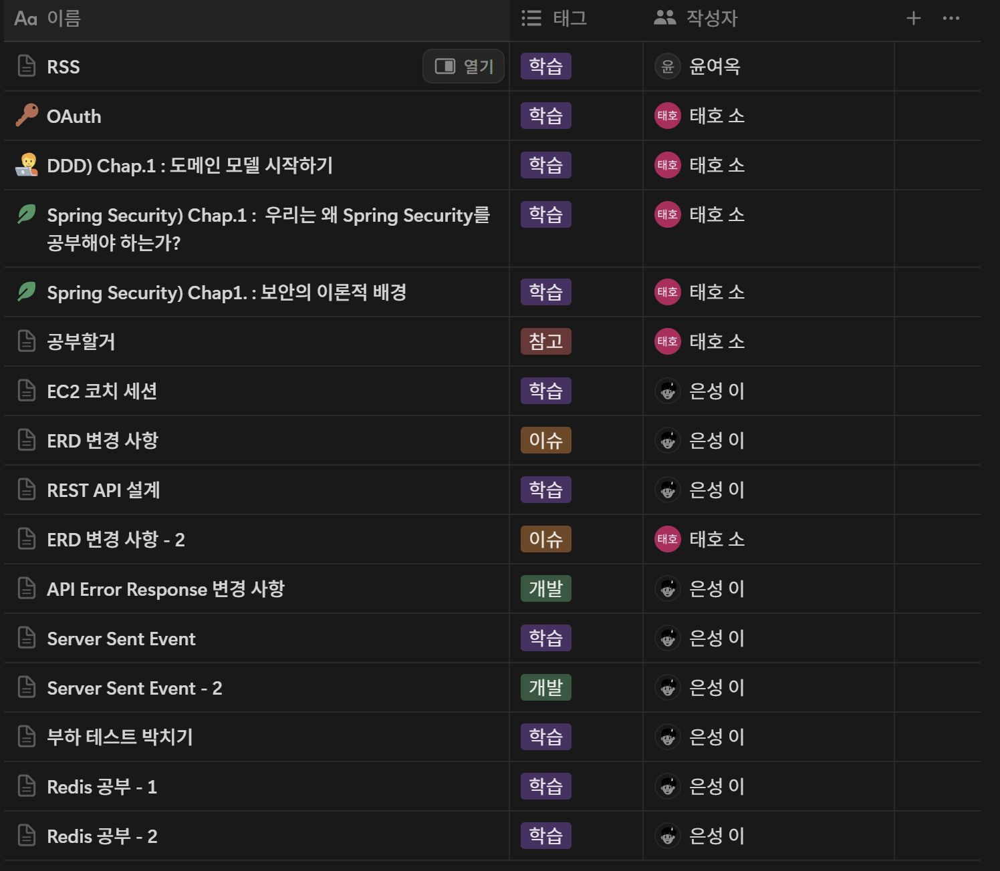

### (3) 회의록 관리

팀원간 활발한 의사소통과 기획의 효율성을 높이기 위해 `꾸준한 회의`를 진행했으며, 회의록을 노션에 정리하고 필요시 참고할 수 있도록 했습니다. 

컨설턴트님 및 코치님들과 함께 미팅한 기록도 전부 문서화 하여, 피드백 시에 침고할 수 있도록 했습니다. 

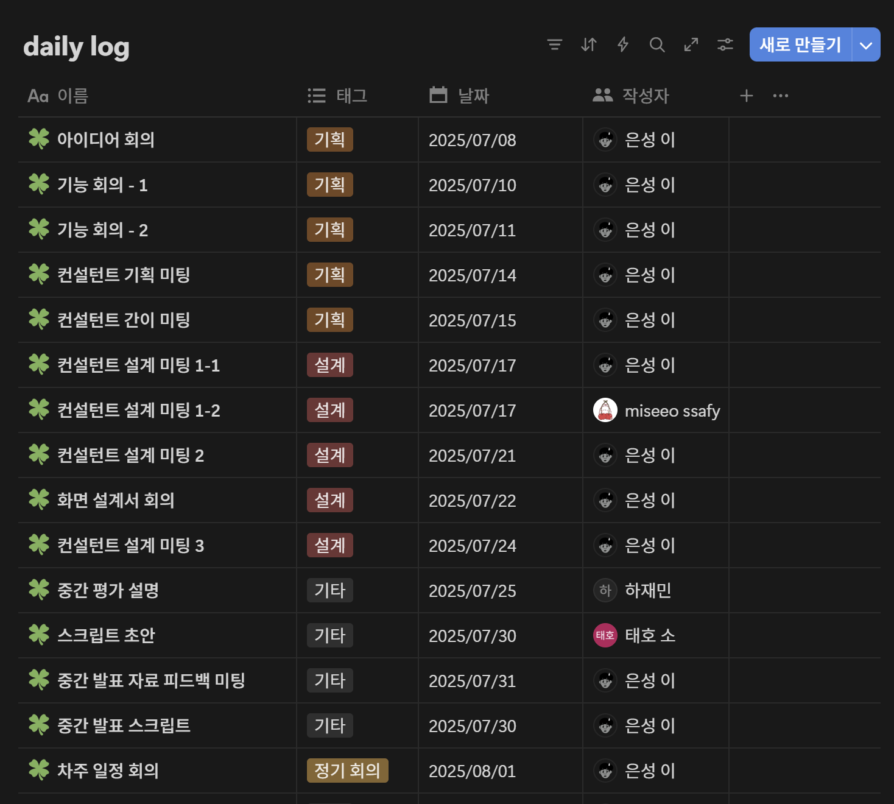
